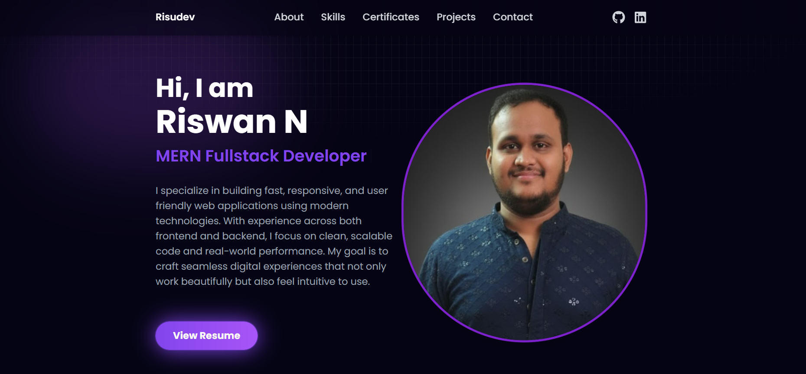

# Riswan - MERN Full-Stack Developer Portfolio

  

Welcome to my **personal portfolio**, showcasing my skills and projects as a **MERN Full-Stack Developer**. This portfolio is built using **React**, styled with **TailwindCSS**, and enhanced with **animations** for smooth user experience.  

---

## 🛠 Technologies Used

- **Frontend:** React, TailwindCSS, Framer Motion (animations), React Router  
- **Icons & UI:** React Icons, Parallax Tilt  
- **Version Control:** Git & GitHub  

---

## 💼 Features

- **Responsive Design:** Mobile-first layout with TailwindCSS  
- **Smooth Animations:** Framer Motion for section fade-ins and hover effects  
- **Projects Section:** Interactive project cards with image tilt effects  
- **Contact Form:** Email integration for recruiter contact  
- **Portfolio Sections:** About, Skills, Certificates, Projects, Contact  

---

